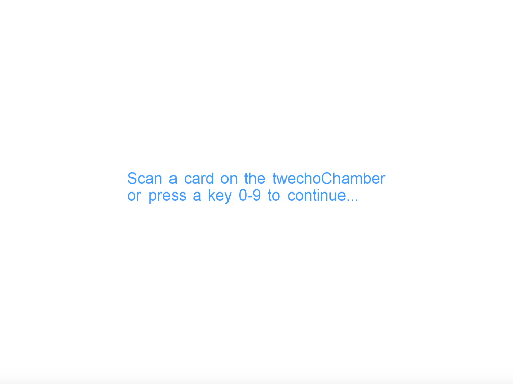
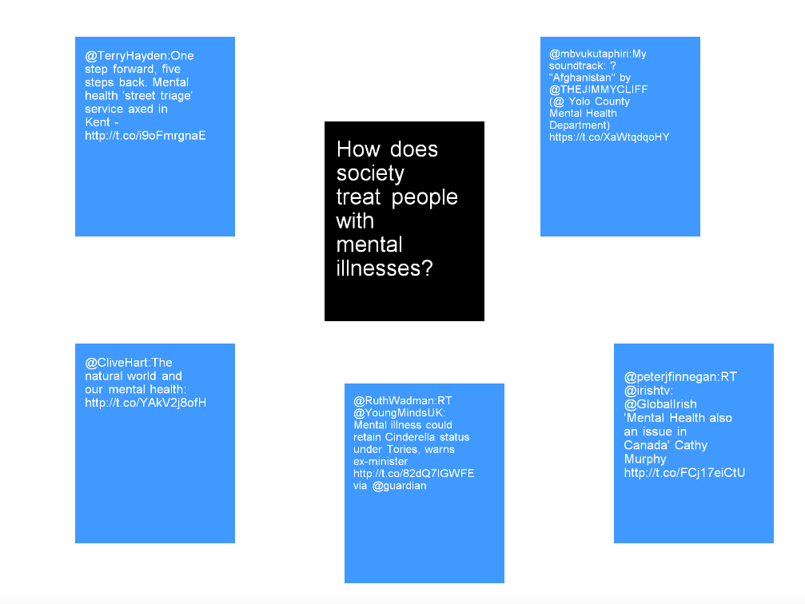
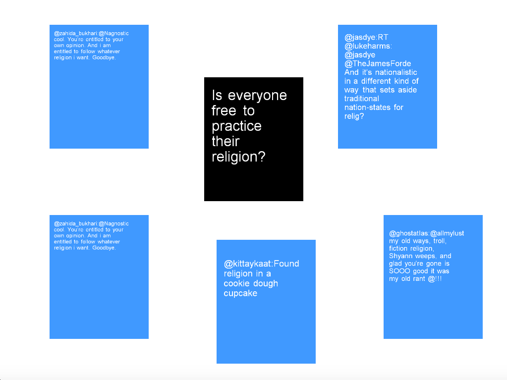

# twechoChamber
twechoChamber is an openFrameworks application that uses RFID technology to raise awareness on the spectrum of opinions around various prevalent social issues. tEchoChamber is meant to act as a window outside of our everyday echo chambers. 

Designed in the vain of popular open-source card games Cards Against Humanity and The Metagame, twechoCamber's "controllers" are RFID cards with icons representing different social problems facing today's society. This version addresses reproductive health, the war on drugs, guns, religious freedom, climate change, mental illness, government oversight, immigration, big data, and healthcare. When the player waves a card by the RFID reader, the application scrapes Twitter for specific keywords related to the issue. Some of the most recent tweets about the topic are displayed, along with a question meant to challenge the player to consider their true opinion on these matters. 

In light of recent uprisings across the United States, I think it is important to have discussions about the polarized opinions our soceity has developed about what's happening in our world. So often we are surrounded mostly by people who have similar opinions, creating an echo chamber that further polarizes opinions. By exposing the player to a variety of opinions around a topic on one screen, they are encouraged to consider the opinions of others, opinions they may not have been aware of before.

twechoChamber empowers individuals to explore the conversations happening around poignant social topics. With social media, we tend to "follow" people and organizations we *want* to listen to. Those with differing opinions often get unfollowed, unfriended, or are muted amongst the noise. twechoChamber's search queries were chosen to return a diverse array of opinions.  The question posed in the center of the screen was written to challange players to consider their opinion on some aspect of the topic.

The home screen prompts players to scan a card or press a key to play:

Example of mental illness card search:

Example of freedom of religion card search:

###Alternative Controller
If you do not have an RFID reader and cards, you can still use this application! Pressing key 0-9 will return the same results as if you were to scan a card. 

###Known Bugs
Becuase of the time it takes to retrieve tweets, tweets displayed may be one search behind the question displayed (i.e. if you scan the mental illness card and then the gun card, you will likely see the question associated with guns, but the first set of tweets displayed with the question will be related to mental health). In order to rectify this issue, some function needs to be called to see if all of the tweets from the most recent search have been loaded before setting the text on the screen. As far as I can tell, no such function exists in the ofxTwitter addon. 

